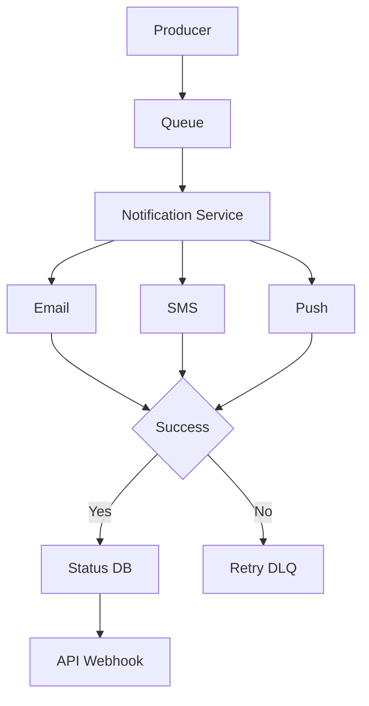

# System Design & Architecture (L6 Revision)

---

## Q1: How do you approach system design

**Memory Trick**  
Problem → Break → Trade-offs → Align → Outcome  

- **Understanding** - I start with business goals and key non-functional requirements like scale, availability, and latency  
- **Decomposition** - I break the system into API, processing, and data layers  
- **Decisions** - I evaluate trade-offs across scalability, maintainability, and ownership  
- **Collaboration** - I align with architecture and platform teams to follow standards and governance  
- **Outcome** - I ensure a simple, scalable system aligned with business needs  

---

## Q2: Monolith vs Microservices

**Memory Trick**  
Simple → Monolith | Scale → Microservices  

- **Decision Factors** - I evaluate domain complexity, team structure, and change frequency  
- **Monolith** - I use monolith for simpler systems with strong consistency needs  
- **Microservices** - I use microservices when independent scaling and team ownership are required  
- **Trade-off** - Microservices add distributed complexity, latency, and operational overhead  
- **Approach** - I start simple and evolve to microservices as the system grows  

---

## Q3: How do you design for scalability

**Memory Trick**  
Stateless → Distribute → Optimize → Async  

- **Service Design** - I build stateless services to enable horizontal scaling  
- **Load Handling** - I distribute traffic effectively to avoid bottlenecks  
- **Data Strategy** - I optimize data access patterns for increasing load  
- **Async Processing** - I use event-driven processing for heavy workloads  
- **Outcome** - I ensure the system handles peak load without performance impact  

---

## Q4: How do you scale a system from 120 to 1200 customers

**Memory Trick**  
Capacity → Architecture → Ops → Team → Execution  

- **Capacity** - First, I baseline current system metrics like throughput(call volume), latency(P95, P99), and storage growth, and project 10x load with buffer to estimate infrastructure and cost  
- **Architecture** - From an architecture perspective, I ensure services are stateless and horizontally scalable, and for heavy workloads like patient data processing, we use distributed pipelines like EMR and partition data by tenant  
- **Operations** - Operationally, I define SLOs, strengthen observability using metrics, logs, and alerts, and improve on-call readiness  
- **Team Scaling** - From a team perspective, I scale from 2 teams to domain-based pods with clear ownership and improve onboarding and standards  
- **Execution** - Finally, I scale incrementally, onboarding customers in phases to ensure stability  

---

## Q5: What changes beyond architecture when system scales

**Memory Trick**  
Scale = Tech + Quality + Process  

- **Reality** - Scaling is not just an architecture problem, it also includes quality, process, and team maturity  
- **Quality Control** - I introduce release gates like test coverage thresholds, defect leakage limits, and security checks in CI/CD  
- **Operations** - I strengthen observability and incident response  
- **Process** - I standardize coding, logging, CI/CD, and onboarding practices  
- **Outcome** - I ensure consistent quality and reliability as the system scales  

---

## Q6: What happens if Kafka fails after DB commit

**Memory Trick**  
DB ✅ Event ❌ → Outbox  

- **Problem** - Data is stored in DB but event is not published, leading to inconsistency  
- **Solution** - I use the Outbox pattern to persist events along with business data  
- **Processing** - A separate publisher service reads from outbox and pushes events to Kafka  
- **Recovery** - Events are retried when Kafka becomes available  
- **Outcome** - I ensure eventual consistency and no data loss  

---

## Q7: Payment service failure – how do you handle

**Memory Trick**  
Fail Fast → Retry → Protect → Compensate  

- **Resilience** - I fail fast instead of blocking the system  
- **Protection** - I use retries with exponential backoff and circuit breakers  
- **User Experience** - I provide clear feedback to users and allow retry  
- **Consistency** - I use Saga pattern for compensation across services  
- **Recovery** - Failed events are pushed to DLQ for retry  
- **Outcome** - I maintain system stability and user experience  

---

## Q8: Testing doesn’t scale with customers

**Memory Trick**  
Manual ❌ → Automation + Priority  

- **Problem** - Manual testing does not scale with increasing customers  
- **Strategy** - I shift to automation and regression testing  
- **Prioritization** - I focus on high-impact and critical scenarios  
- **Optimization** - I improve test data reuse and management  
- **Outcome** - I enable faster onboarding without compromising quality  

---

## Q9: Design a Notification System

**Memory Trick**  
Producer → Queue → Service → Channel → Retry → DB  

- **Architecture** - I design it as an event-driven system for better decoupling  
- **Flow** - Producers publish events to a queue and the notification service consumes and processes them  
- **Delivery** - I support multiple channels like email, SMS, and push notifications  
- **Reliability** - I implement retries with backoff and use DLQ for failed messages  
- **Tracking** - I maintain notification status and expose it via APIs or webhooks  
- **Scalability** - I partition events based on user or domain  
- **Key Focus** - I ensure idempotency and delivery guarantees  

---

## Q10: When do you use Saga (Choreography vs Orchestration)

**Memory Trick**  
No ACID → Choreo (simple) → Orchestration (control)  

- **Need** - I use Saga when a transaction spans multiple services and cannot be handled using a single ACID transaction  
- **Choreography** - I use choreography for simple flows where services react to events independently, but it becomes harder to debug  
- **Orchestration** - I prefer orchestration for complex workflows as it provides better control and observability  
- **Trade-off** - Choreography provides simplicity, while orchestration provides control and visibility  
- **Approach** - In critical healthcare workflows, I prefer orchestration for better reliability and traceability  

---

## Q11: How do you design for failure and reliability

**Memory Trick**  
Fail → Isolate → Recover → Degrade  

- **Design** - I design systems assuming failures across services and dependencies  
- **Isolation** - I isolate failures to prevent cascading impact  
- **Recovery** - I implement retries and fallback mechanisms  
- **Degradation** - I support partial functionality instead of full outage  
- **Monitoring** - I detect issues early using alerts and observability  
- **Outcome** - I minimize customer impact  

---

## Q12: How do you design for high availability

**Memory Trick**  
No Single Point of Failure  

- **Redundancy** - I deploy multiple service instances  
- **Failover** - I implement backup mechanisms for critical components  
- **Load Distribution** - I distribute traffic to avoid single points of failure  
- **Monitoring** - I use health checks and alerts  
- **Outcome** - I ensure system availability during failures  

---

## Q13: How do you handle data consistency

**Memory Trick**  
Correctness vs Scale  

- **Strong Consistency** - I use it when correctness is critical  
- **Eventual Consistency** - I use it for scalable distributed systems  
- **Trade-off** - I balance consistency and performance  
- **Approach** - I prefer eventual consistency with safeguards for critical flows  
- **Outcome** - I ensure scalable and reliable data handling  

---

## Q14: Real example from your experience

**Memory Trick**  
Analyze → Optimize → Save Cost  

- **Problem** - We had high infrastructure cost and inefficiencies  
- **Analysis** - I identified underutilized services and inefficiencies  
- **Execution** - I led migration to Kubernetes-based platform  
- **Result** - We reduced cost by approximately $5M annually  
- **Learning** - I learned the importance of platform optimization and right-sizing  

##  Q15: 12 Factor app

- 12-factor app methodology is primarily used in cloud-native and microservices-based systems to ensure scalability, portability, and maintainability.

- In my experience, we apply many of these principles during Kubernetes-based deployments—like keeping services stateless for horizontal scaling, externalizing configuration, and treating dependencies like databases or Kafka as backing services.

- We also follow build-release-run separation in our CI/CD pipelines and treat logs as event streams for observability.

- These principles become especially important when scaling systems and teams, because they ensure consistency across services and environments.